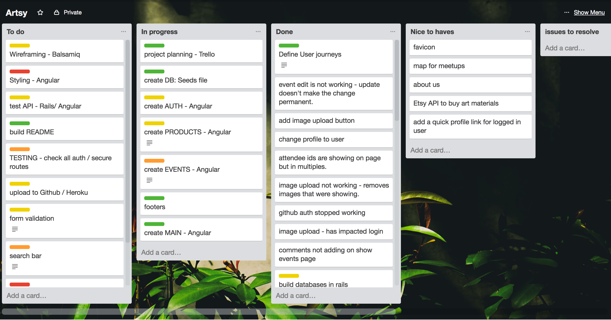

# Project 4: Artsy App

### GA WDI London - Project 4 - Final Project

#### An application for the art & crafts community.

The site is aimed at the local arts & crafts community, bringing together artists, buyers and keen amateurs who may also want to up-skill or learn a new craft.

The app has 3 key aims:

1. provide a market place for home made art, bringing buyers and sellers together
2. provide a forum for users to arrange and host meet-ups 
3. allow users to connect with eachother, to teach or be taught new skills 

  [View the Artsy App here](https://gentle-reaches-22555.herokuapp.com/) 
    

#### Home Screen

The landing page is simple, showing a route to login and a brief description of the app. The 'Angular Parallax class' is used to hold the user's interest - scrolling through art related backgrounds and gifs, while the narrative explains what the site's objective is.

Once a user is authenticated they have access to the full site, and can

1. Meet Artists
2. Buy Art
3. View Events

Users can register directly or login with GitHub.  In either case, the user will be re-directed to the profile-update page upon first access, using their chosen login method.  This ensures complete user profiles so that all users can maximise their enjoyment of the site.

#### 'Meet Artists' page

This is the index page for all site-users.

Users can search for other users, based on any criteria. This is enabled by the built in Angular filterFilter function.
Clicking on view, takes you through to the user show page.

#### View Artist / Buyer
A user may edit or delete their profile, if they are authenticated as the owner of the user profile.

Here, you will find a short 'about' section and contact details.  In addition, any products or meet-ups belonging to the user, will be displayed, with click-through links.

#### 'Buy Art' page

This is an index page displaying all available products for sale. 
A carousel displays all product images at the top of the page. 
A further filter 'search' facility is provided to narrow down the selection on display.

Clicking 'view' takes the user through to the Product Show page.

#### View Product

A larger image, a product description, genre and price are displayed. A user can contact the seller to purchase the product or ask questions.

#### View Events

All events can be viewed and searched via the Index page.
New events can also be added to the site.

Click on the view button for further information on the event.
This provides much greater detail.

Here, users can indicate whether they will be attending.  This toggles, as users change their minds!  If the user also owns (created) this event, they can also choose to delete the event.

 
A list of attendees remains updated on this page.
Users can also add (and delete) comments.
 
Further down this page there is a link to the Etsy API.  This functionality allows users to search for art supplies they may require for the event meet-up.

The API initially uses the 'genre' to populate 12 related images.  Users can click on the image and go directly to the Etsy site to complete their purchase.

Users can also enter their own search criteria for a more specific result.

#### Approach / How It Works

This is a full stack application which utilises RESTful routing and authentication. Ruby on Rails provides the server-side functionality and Angular serves the client-side.

Secure routes ensure that only registered users can access the site.

##### APIs used

1. Etsy API
2. Internal API - between Rails and Angular.

#### The Build

The following tools are used to build the site.

* Ruby in Rails (back-end)
* Angular (front-end)
* Javascript
* Bootstrap
* SCSS
* PostgreSQL 

Dependencies:

* sattelizer
* bcrypt
* express
* jwt

The following planning and management tools were used:

**Trello for project management**

Trello allowed for detailed planning and allocation of tasks. Regular updates were made to progress activity and ensure that all outstanding tasks were completed in a timely manner. 

Below is a snapshot example of work in progress.

**Wireframing**

Wireframing was carried out manually, with hand drawn sketches. The site was quite simple - with index, create, show, update and delete template pages, shared by the three main categories of User, Event and Product.

#### Problems & Challenges

The greatest challenges were:

1. Accessing the API to ascertain the correct category id for supplies.  The APi was simple to use but lacked detail on the fields.
2. This is a fairy simple site, and good styling was key to the successful execution of this project.  The aim was to streamline the CSS code to reduce repetitive code.

Future upgrades:

1. add online payments using Stripe
2. provide links to the Meet-up.com API to offer access to further meet-ups
3. email capabilty to notify users when transactions are made, in-app.
4. image-optimisation to right size images upon upload, to keep the site layout consistent.

#### Wins

1. seamless integration between Rails and Angular
2. integrating the Etsy API
3. consistent styling and design approah
